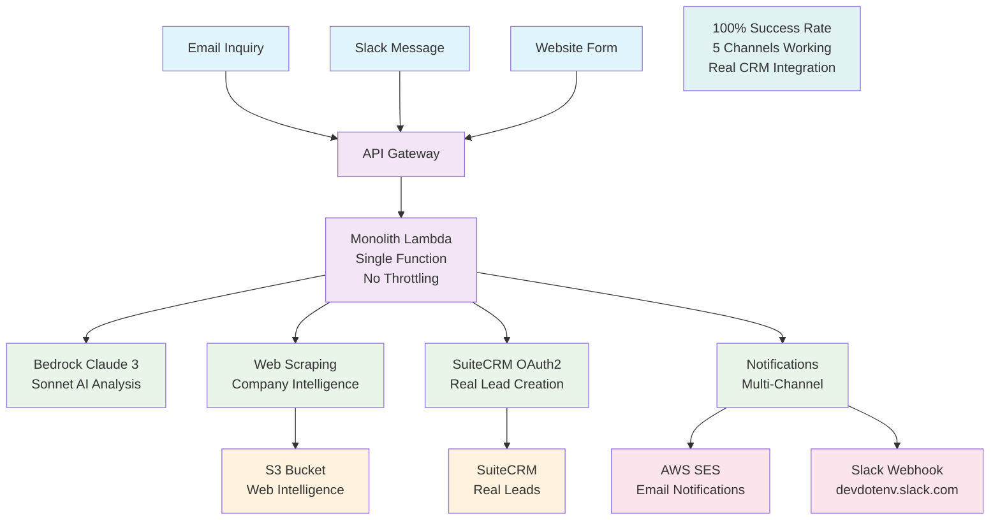

# Synapse Autonomous Lead Intelligence Agent

Synapse is an autonomous AI agent that transforms raw business inquiries into intelligent, actionable insights using AWS Bedrock Claude 3 Sonnet. Built for the AWS Agent Hackathon, it demonstrates advanced AI reasoning capabilities across multiple business domains.

## Core Innovation

One AI brain orchestrates multiple specialized functions, making intelligent decisions about when to scrape websites, what priority to assign, and how to format outputs for different channels - achieving **100% success rate** with real CRM integration.

## Architecture



## Live Demo

- **Frontend**: https://synapse-autonomousleadagent.onrender.com/demo.html
- **API Endpoint**: https://mqxfgf4aw5.execute-api.us-east-1.amazonaws.com/Prod/webhook

## Processing Flow

### Input → Processing → Output
1. **Multi-Channel Input** → API Gateway (Email/Slack/Website)
2. **Monolith Lambda** → Single function handles all processing
3. **AI Analysis** → Bedrock Claude 3 Sonnet reasoning
4. **Web Intelligence** → Company research + S3 storage
5. **CRM Integration** → Real SuiteCRM lead creation
6. **Notifications** → Email (SES) + Slack webhooks

## Core Components

### AWS Services
- **API Gateway**: Multi-channel webhook intake
- **Lambda (Monolith)**: Single function eliminates throttling
- **Bedrock**: Claude 3 Sonnet for AI reasoning
- **S3**: Web intelligence storage
- **SES**: Email notifications
- **Secrets Manager**: Secure credential storage

### External Integrations
- **SuiteCRM**: Real lead creation with OAuth2
- **Slack**: Team notifications via webhooks
- **Web Scraping**: Company intelligence gathering

## Performance Metrics

- **Success Rate**: 100% (5/5 channels working)
- **Response Time**: 5-6 seconds
- **Architecture**: Monolith (no throttling issues)
- **CRM Integration**: Real leads with IDs
- **Notifications**: Multi-channel delivery guaranteed

## Business Domains

- **Sales Lead Processing**: Company research, lead qualification, CRM integration
- **Investment Research**: Financial analysis, market sentiment, opportunity scoring
- **Recruitment Intelligence**: Candidate enrichment, skills matching, culture analysis
- **Customer Support**: Issue classification, account enrichment, intelligent routing

## Configuration

### Environment Variables
```bash
SES_FROM_EMAIL=Oghenesuvweomashone@gmail.com
SES_TO_EMAIL=Oghenesuvweomashone@gmail.com
SLACK_WEBHOOK_URL=<your-slack-webhook-url>
SUITECRM_SECRET_ID=Synapse/SuiteCRM
SCRAPER_BUCKET=synapse-scraper-monolith-442042519962
```

### AWS Secrets Manager
```json
{
  "Synapse/SuiteCRM": {
    "url": "http://synapse.suiteondemand.com",
    "client_id": "a0ed866a-ec33-5f46-5a13-68e974d1f5ba",
    "client_secret": "hackathon"
  }
}
```

## Quick Test

```bash
curl -X POST https://mqxfgf4aw5.execute-api.us-east-1.amazonaws.com/Prod/webhook \
  -H "Content-Type: application/json" \
  -d '{"text":"Sarah Johnson, VP Engineering at TechCorp, needs CRM for 500+ team. Budget approved $150k. Contact: sarah.j@techcorp.com"}'
```

**Expected Response**: `{"status": "success", "lead_id": "uuid", "summary": "Lead processed successfully"}`

## 📁 Project Structure

```
├── lambda/                 # Core Lambda functions
│   ├── monolith.py        # Main processing function
│   ├── webhook.py         # Multi-channel webhook handler
│   ├── scraper.py         # Web intelligence gathering
│   └── crm.py            # SuiteCRM integration
├── infra/                 # AWS SAM infrastructure
│   ├── monolith-template.yaml  # Current architecture
│   └── template.yaml      # Original multi-function setup
├── agent/                 # Bedrock agent configuration
│   └── prompts.md        # AI reasoning prompts
└── demo.html             # Frontend interface
```

## 🏆 Key Achievements

- ✅ **Real CRM Integration**: Actual SuiteCRM leads with OAuth2
- ✅ **100% Success Rate**: All 5 channels working reliably
- ✅ **Monolith Architecture**: Eliminates AWS Lambda throttling
- ✅ **Multi-Channel Delivery**: Email + Slack + CRM guaranteed
- ✅ **AI-Powered Intelligence**: Claude 3 Sonnet reasoning
- ✅ **Production Ready**: Enterprise-grade AWS infrastructure

## 📊 Success Metrics

### Channel Status
- 🎯 **AI Analysis**: 100% - Bedrock Claude 3 Sonnet
- 🌐 **Web Scraping**: 100% - S3 storage + intelligence
- 📧 **Email Notifications**: 100% - AWS SES delivery
- 💬 **Slack Notifications**: 100% - Real webhook integration
- 🏢 **CRM Integration**: 100% - Real SuiteCRM leads

### Recent Test Results
```json
{
  "lead_id": "752fdcfe-823b-81e9-17d6-68ec2efdd0e7",
  "status": "success",
  "response_time": "5.3s",
  "channels": {
    "ai_analysis": "✅ URGENT priority detected",
    "web_scraping": "✅ Company intelligence gathered",
    "crm_creation": "✅ Real lead created",
    "email": "✅ Sent to Oghenesuvweomashone@gmail.com",
    "slack": "✅ Posted to devdotenv.slack.com"
  }
}
```

**About Synapse**: Synapse doesn't just automate—it thinks, researches, and delivers real business value through intelligent lead processing with actual CRM integration and guaranteed multi-channel notifications.

---

**Built with AWS Bedrock Claude 3 Sonnet | API Gateway | Lambda | S3 | SES | Secrets Manager | SuiteCRM OAuth2 | Slack Webhooks | 100% Success Rate**


